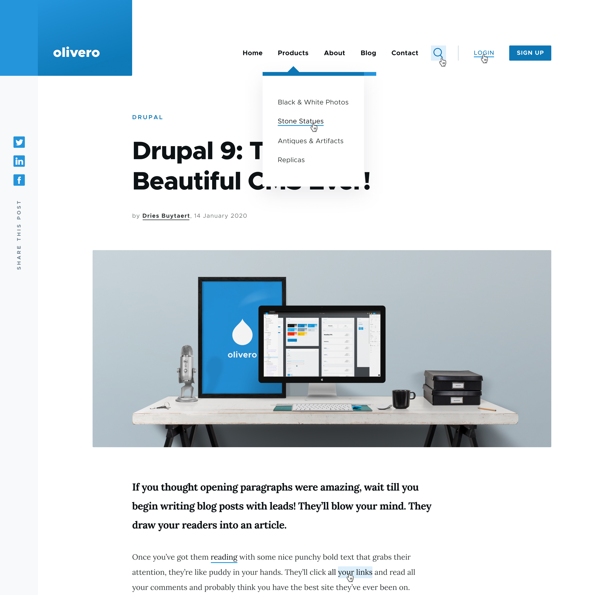

## Drupal 10 and beyond

Note:
- welcome
- make yourself comfortable good program of sessions coming up

---

### About me

@larowlan

Note:

- Drupal development for 13 years
- PHP Development for 20
- Core committer, Security team you're probably using one of my modules

---

### ️Overview

<ul>
<li class="fragment fade-in-then-semi-out">Where are we?</li>
<li class="fragment fade-in-then-semi-out">Where are we going?</li>
<li class="fragment fade-in">Where do we need to go?</li>
</ul>

Note:

- fragments*
- two part informative
- one part my typical navel gazing exercise
- i hope you come away with some things to mull over

---

# Where are we?

---

### Drupal 10 will come out next year

---

### Three scenarios

<ul>
<li class="fragment fade-in-then-semi-out"><strong>Planned: June 15 2022</strong></li>
<li class="fragment fade-in-then-semi-out">Fallback: August 17 2022</li>
<li class="fragment fade-in">Break-glass: December 14 2022</li>
</ul>

---

### Drupal 9

Drupal 9.3 is due December 8

*Please help us test the pre-releases

---

### Drupal 9.4

<ul>
<li class="fragment fade-in-then-semi-out">Drupal 9.4 will co-incide with Drupal 10.0*</li>
<li class="fragment fade-in">Drupal 10.0 with deprecated code</li>
</ul>

*All things going to plan

---

### Drupal 8

Note: 

- Drupal 8 came out in 2015 and is nearly 6 years old
- iphone 6
- star wars episode 8 was in cinemas

---

<!-- .slide: data-transition="fade" -->

### 🪦 Drupal 8 is End Of Life

---

<!-- .slide: data-transition="fade" -->

### 🪦 Drupal 8 will have no more security updates*

*All things going to plan

Note:

- So if you're still on Drupal 8, your job next week is to move to Drupal 9

---

### 🧚 Updating to Drupal 9 is much easier

https://pnx.me/3C6v3kH

Note:

- Provided you're on Drupal 8

---

### But I'm on Drupal 7!

Note:

- Drupal 7 came out in 2011
- You were rocking an iphone 4
- thunderbolt displays just came out
- Game of Thrones season 1 was just out
- 2 years before Brooklyn 99
- the last harry potter movie was in cinemas
- Drupal 7 is the Windows XP of Drupal
- And I don't mean that its the only thing your grandparents and banks can agree on
- it was super successful and is everywhere

---

### Drupal 7

<ul>
<li>Is end of life in Nov 2022</li>
<li class="fragment fade-in-then-semi-out">There will be an Extended support option</li>
</ul>

Note:

- Extended support will likely require either a paid subscription or self serve

---

### Is 2 years too soon?

---

### No

We need to give people time to upgrade

---

### So what's driving this?

🥜 In a nutshell - security

---

### Drupal 8

<h4>Drupal 8</h4>

Symfony 3

PHP 7.0+

CKEditor 4

  

<ul>
<li class="fragment">Symfony 3 EOL - Nov 2021</li>
<li class="fragment">PHP 7.0 EOL - <strong>Jan 2019</strong></li>
</ul>

Note:
- So the EOL for Drupal 8 co-incides with EOL of symfony 3
- actually, symfony extended security support for Sf 3 after Alex Pott and I joined their security team to help with backporting 

---

### Drupal 9

<h4>Drupal 9</h4>

Symfony 4

PHP 7.3+

CKEditor 4

<ul>
<li class="fragment">Symfony 4 EOL - Nov 2023</li>
<li class="fragment">PHP 7.3 EOL - Dec 2021</li>
<li class="fragment">CKEditor 4 EOL - Nov 2022</li>
</ul>

Note:
- So CKEditor is driving the Drupal 10 release date
- We want 10 out at least 6 months before EOL for CKEditor 4

---

### Drupal 10

<h4>Drupal 10</h4>

Symfony 5 or 6*

PHP 8.0 or 8.1*

CKEditor 5

<ul>
<li class="fragment">Symfony - Nov 2025 vs 2027</li>
<li class="fragment">PHP - Nov 2023 vs 2024</li>
</ul>

*All things going to plan

---

### Noticing a pattern here?

Dependencies are driving our release dates

We're one major release behind Symfony

---

# Where are we going?

---

### Drupal 11?

💬Adopt a 2 year major release cycle and a 6 month LTS-to-LTS overlap period for Drupal 10 and beyond

https://drupal.org/node/3238652

Note:
- Let's unpack that a bit
- We've had 6 monthly minors since 8.0
- But no certainty for majors

---

### Now: Minor updates

<h4>Drupal 9.1.0</h4>

🐣 Dec 2020

🪦 Nov 2021

You must update once a year

---

### What we're proposing*

<h4>Drupal 10.0</h4>

🐣 June 2022

<h4>Drupal 10.4</h4>

🐣 Mar 2024

<strong>🪦 Sep 2026</strong>

<h4>Drupal 11.0</h4>

🐣 June 2024

<h4>Drupal 11.4</h4>

🐣 Mar 2026

<strong>🪦 Sep 2028</strong>

<h4>Drupal 12.0</h4>

🐣 Jun 2026

<h4 class="small remove fragment fade-in-then-out" data-fragment-index="1">Regular 2 year majors</h4>
<h4 class="small remove fragment fade-in-then-out" data-fragment-index="4">LTS release 3 months before next major</h4>
<h4 class="small remove fragment fade-in-then-out" data-fragment-index="7">6 month overlap between LTS releases</h4>

*Assuming https://drupal.org/node/3238652 gets consensus

---

### What we're proposing*

<h4>Drupal 10.4.0</h4>

🐣 Mar 2024

🪦 Sep 2026

You must update once every two and a half years

*Assuming https://drupal.org/node/3238652 gets consensus

---

### Disclaimers

<ul>
<li class="fragment">Hinges on releasing Drupal 10 on Symfony 6.0 and PHP 8.1</li>
<li class="fragment">Assumes our other dependencies play nice</li>
</ul>

Note:
- We may need to fork/backport/shim

---

<!-- .slide: data-transition="fade" -->

<h3>What's coming in Drupal 10</h3>

---

<!-- .slide: data-transition="fade" -->

<h3><del>What's coming in Drupal 10</del></h3>

Note:
- Stop thinking that way

---

<!-- .slide: data-transition="fade" class="twocol" -->

### What's coming in Drupal 9.3?

<ul>
<li class="fragment">PHP 8.1 support</li>
<li class="fragment">Bundle classes</li>
<li class="fragment">Manage permissions tab</li>
<li class="fragment">Generic revision access</li>
<li class="fragment">CKEditor 5*</li>
<li class="fragment">Olivero/Claro stable*</li>
</ul>

*All things going to plan

Note:
- Start thinking this way
- We build Drupal 10 in Drupal 9
- We build Drupal 11 in Drupal 10

---

### Manage permissions tab

---

### CKEditor 5

---

<!-- .slide: class="twocol" -->

### What's coming in Drupal 9.4?

<ul>
<li class="fragment">Olivero/Claro stable</li>
<li class="fragment">Forum/Hal/Aggegator/Quickedit moved to contrib</li>
<li class="fragment">Decoupled menus module*</li>
<li class="fragment">Expanded JSON:API revision support*</li>
<li class="fragment">Generic revision UI*</li>
<li class="fragment">New autocomplete/dialog*</li>
</ul>

*All things going to plan

Note:
- Deprecations until D11 except the modules going to contrib
- Moving away from jQuery UI

---

### Olivero

---

### Drupal 10.0 will be boring

<ul>
<li class="fragment">9.4 minus deprecations</li>
<li class="fragment">Easier again to upgrade</li>
</ul>

Note:
- For those of you still on D7 this will be cold comfort but we've learnt from that process

---

### Moving to D10

Note:
- Much of the work to move to update D9 code D10 can be automated.

---

### What about in Drupal 10.x?

🎁 This is where the goodies start

Note:
- In this new way of thinking, this is how we build Drupal 11

---

### Automatic updates

<ul>
<li class="fragment">✅PSAs in UI</li>
<li class="fragment">✅Readiness checks API</li>
<li class="fragment">✅Signing updates</li>
<li class="fragment">✅Applying updates with rollback</li>
<li class="fragment">⏳Composer based updater</li>
</ul>

---

### Automatic updates

---

### Project browser

Note:
- Why is this important? Global training day
- Work happening in contrib
- Join the team
- Will build on top of automatic updates to work with composer under the hood

---

### Easy out of the box

<ul>
<li class="fragment">Layout builder</li>
<li class="fragment">Media</li>
<li class="fragment">Claro</li>
</ul>

Note:
- enabling these in standard profile
- my opinions on standard profile are well known, see my session from Drupal South gold coast
- Umami profile has shown this is possible
- We want people starting their sites with a good foot forward

---

### Starter kit theme

drupal.org/node/3050378

Note:
- those of you who've been around long enough would remember zen theme's commands for generating a new theme
- its the same concept
- we'd deprecate and remove classy/stable
- it allows us to change template markup to fix bugs without breaking people's sites

---

### jQuery

<ul>
<li class="fragment">☠️ Continue the jQuery death march</li>
<li class="fragment">drupal.org/node/3238306</li>
</ul>

Note:
- we are progressively turning on no-jquery eslint rules
- there are a load of easy issues to get involved in
- great for tomorrow's code sprint!!

---

# Where do we need to go?

Note:
- This commences the navel gazing part of the talk
- I hope we can use this to have some structured Q and A

---

### Contributions are down

10% decline in individual contributors

2% decline in organizational contributors

Note:
- Covid is a factor, but no new faces are also an issue

---

### Business is booming

Note:
- source: Drupal Business Survey 2021
- Less sites, but bigger budgets
- You can see that in the D7 vs D8 usage stats
- There are more installs of D7 jQuery update than all D8 and 9 sites.

---

### Talent is scarce

Note:
- Anyone hiring lately, its hard
- The pool of faces isn't growing
- Oxide, PreviousNext, Salsa, NSW Department of customer service
- Check the #jobs channel

---

### Barriers to entry

Note:
- Think about how you got started
- Myself I built small sites for local businesses
- Bigger projects have less opportunties for that
- The drupal association has a new mentoring program
- There is so much prior knowledge required just to be productive
- initiatives like project browser help
- the last global training day I ran, I avoided talking about adding modules to the site because its a minefield
- this used to be a major selling point 'there's a module for that'
- but now its too complex to cover in a single day's training

---

### JavaScript is eating the web

Note: 
- The web landscape has changed
- Atwood's law "anything that can be written in javascript will eventually be written in javascript"
- Decoupled CMS as a service offering are coming up fast behind us
- Entry to this space is much simpler

---

### Decoupled menus initiative is a step in the right direction

Note:
- Work out how to ship npm packages
- Work out tooling for non PHP projects
- Gitlab features like pages, CI, publishing to NPM
- Once library is using it
- JSON:API is a start but there are many places where API is second class citizen to theme/form apis
- Stuart and Nuxt is doing some amazing work on this front
- I spoke about this topic at length at Decoupled days

---

### What can we as an AU/NZ community do?

Note:
- What can we do locally to improve onboarding for users
- Vlad in Brisbane at the TAFE
- Murray in Sydney working with TAFE
- NZ meetup committee were talking about this too

---

### Credits

- http://slides.com/gaborhojtsy/state-of-drupal-10-readiness-sept-2021
